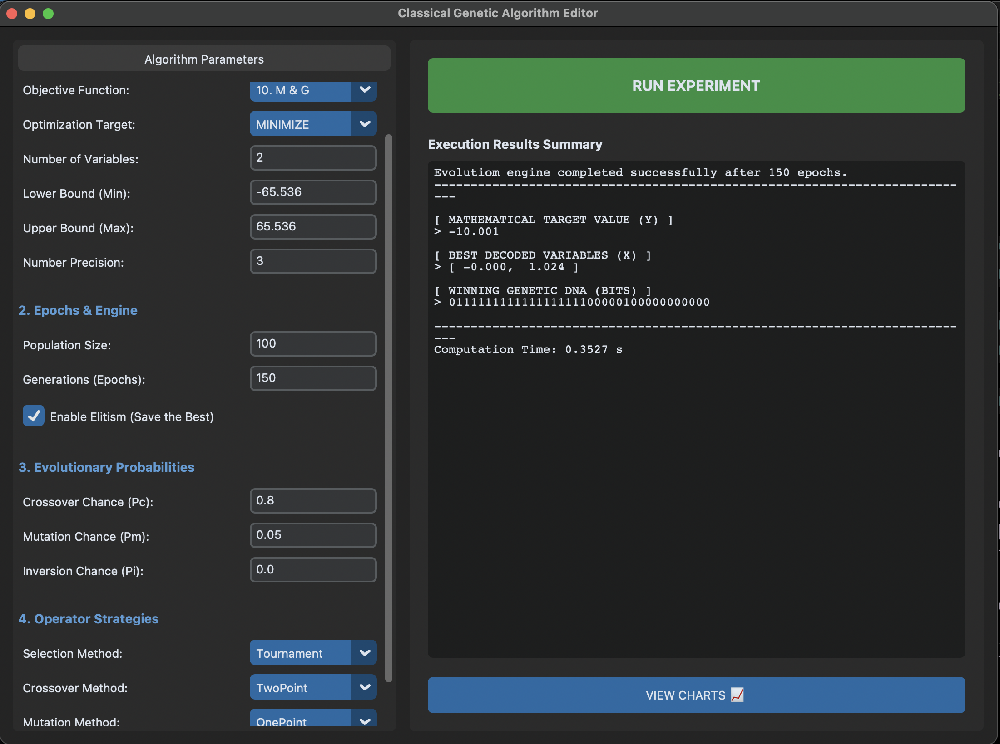
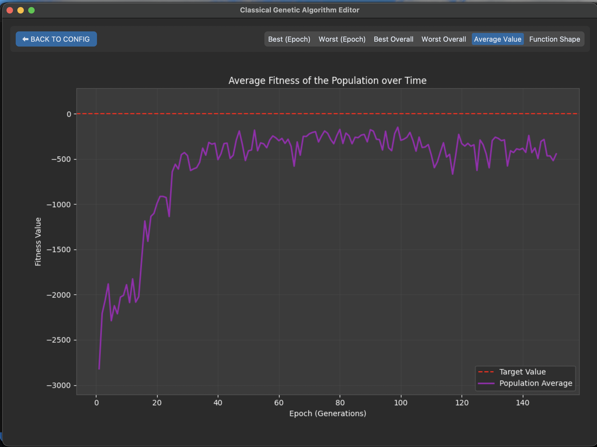

# Classical Genetic Algorithm





A desktop application for visualizing and optimizing various mathematical test functions using a Classical Genetic Algorithm.

## Startup Instructions

1. **Clone the repository:**
   ```bash
   git clone https://github.com/balicz3k/GeneticAlgorithm.git
   cd GeneticAlgorithm
   ```

2. **Set up a virtual environment (optional but recommended):**
   ```bash
   python3 -m venv .venv
   source .venv/bin/activate  # On Windows: .venv\Scripts\activate
   ```

3. **Install dependencies:**
   ```bash
   pip install -r requirements.txt
   ```

4. **Run the application:**
   ```bash
   python main.py
   ```
